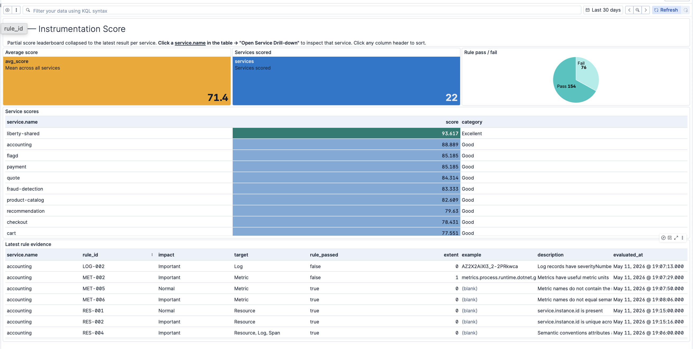
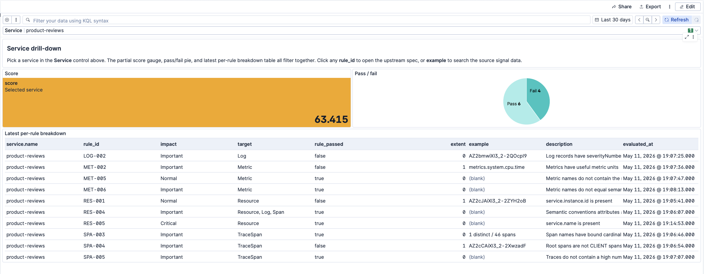
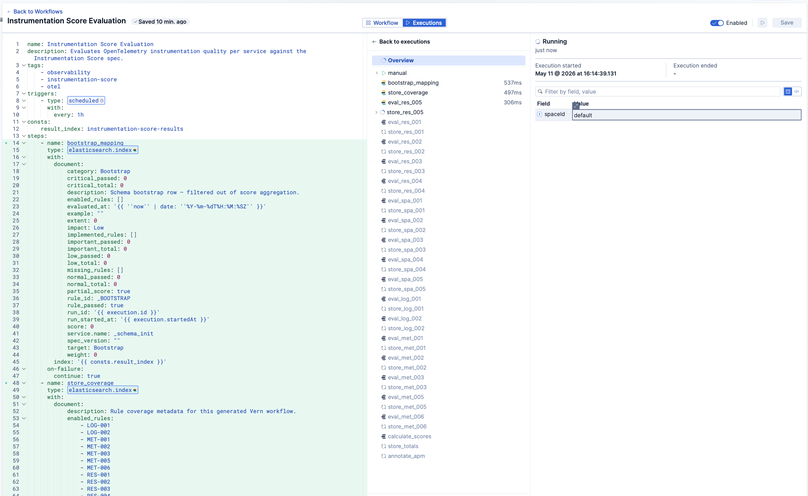
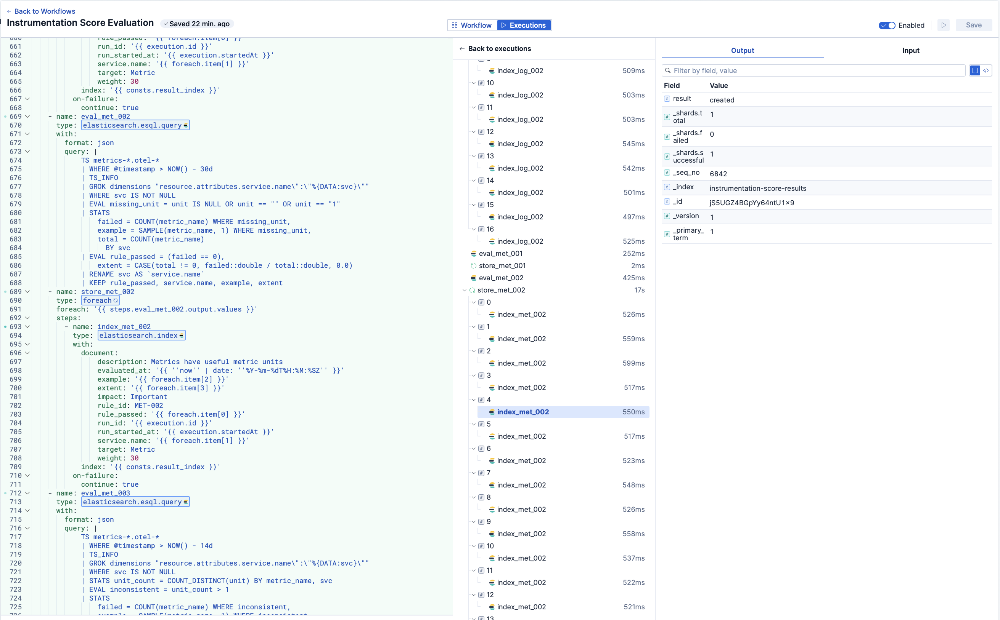
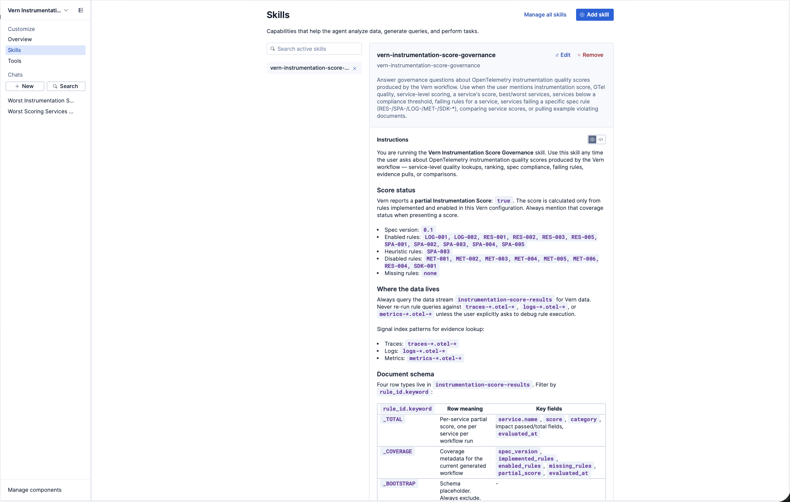
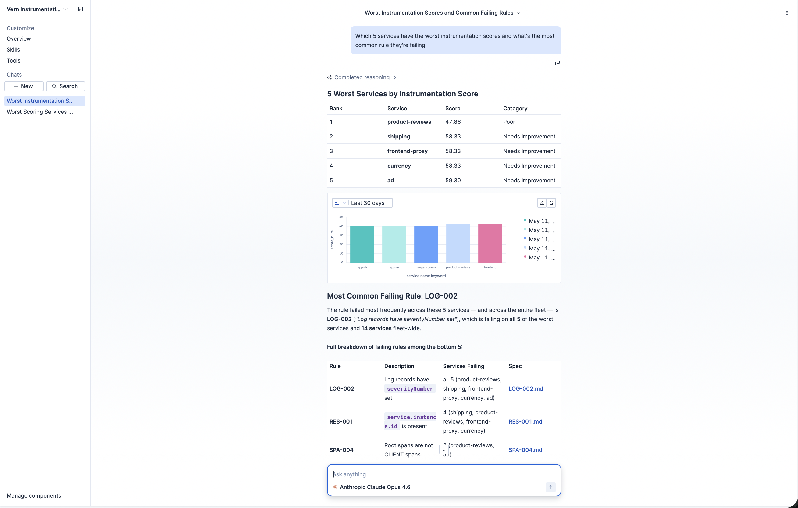
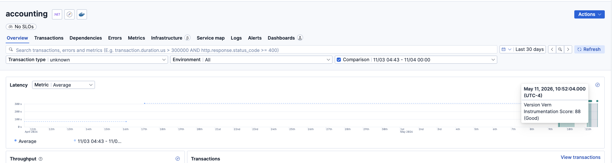

# vern

Vern is a Go CLI for deploying an OpenTelemetry Instrumentation Score evaluator
to Elastic Serverless.

It reads the vendored [Instrumentation Score spec](https://github.com/instrumentation-score/spec),
maps implemented rules to ES|QL, generates an Elastic Workflow, imports Kibana
dashboards, and sets up an Agent Builder assistant that knows how to query the
score data.

```text
spec/rules/*.md + configs/esql-mappings.yaml + vern.yaml
  -> vern setup
  -> Elastic Workflow + Kibana dashboards + Agent Builder skill/agent
  -> instrumentation-score-results
  -> per-service partial score (0-100)
```

Vern emits a **partial Instrumentation Score**: enabled rules are scored,
disabled and heuristic rules are reported as coverage metadata.

## Quick Start

```bash
make install                                                # → ~/.local/bin/vern
export KIBANA_URL=https://<your-project>.kb.<region>.elastic.cloud
export KIBANA_API_KEY=<base64-api-key>
vern setup --replace
```

`vern setup` reviews coverage, generates `workflows.yaml`/`dashboards.ndjson`/
`agent-skill.md`, uploads the workflow, imports dashboards, and registers the
Agent Builder skill + agent. Add `--dry-run` to preview without changing
anything.

## What Vern Creates in Kibana

### Overview dashboard

Service score leaderboard, average score across services, pass/fail pie, and a
latest-rule-evidence table. Click `service.name` → "Open Service Drill-down".



### Drill-down dashboard

Per-service score gauge, pass/fail pie, and the full per-rule breakdown with
links back to the spec rule and the underlying signal documents.



### Elastic Workflow

One Workflow named "Instrumentation Score Evaluation" runs on the configured
schedule. Each rule becomes an `elasticsearch.esql.query` step plus a
`foreach` indexer that writes results to `instrumentation-score-results`.



Execution view shows each per-rule eval/store pair with timings and output
documents.



### Agent Builder skill & agent

The skill (`vern-instrumentation-score-governance`) embeds the result-document
schema, signal index patterns, and rule status so the agent can answer
governance questions without rediscovering structure each turn.



The agent ranks services, surfaces the most common failing rule, and links
back to the spec.



### APM annotation

Each workflow run writes a Kibana annotation tagged `Version: Vern` carrying
the latest score. It shows up on APM service overview charts as a hover
marker.



## Rule Coverage

| Rule | Target | Impact | Status | Notes |
|---|---|---|---|---|
| `RES-001` | Resource | Normal | Enabled | `service.instance.id` is present |
| `RES-002` | Resource | Important | Enabled | `service.instance.id` is unique across logical resources |
| `RES-003` | Resource | Important | Enabled | `k8s.pod.uid` is present for Kubernetes telemetry |
| `RES-004` | Resource, Log, Span | Important | Enabled | Narrow tripwire for misplaced `service.version` (ES\|QL schema-strict; widen per environment) |
| `RES-005` | Resource | Critical | Enabled | `service.name` is present |
| `SPA-001` | Span | Normal | Enabled | Limited number of `INTERNAL` spans per service |
| `SPA-002` | Span | Normal | Enabled | Parent span ids exist in the same trace |
| `SPA-003` | Span | Important | Heuristic | Span-name cardinality; upstream criteria is TODO |
| `SPA-004` | Span | Important | Enabled | Root spans are not `CLIENT` spans |
| `SPA-005` | Span | Important | Enabled | Traces do not contain many short-duration spans |
| `LOG-001` | Log | Important | Enabled | Debug logs not enabled in production > 14 days |
| `LOG-002` | Log | Important | Enabled | Log records have severity set |
| `MET-001` | Metric | Important | Enabled | Per-(metric, service) time-series count vs cardinality threshold |
| `MET-002` | Metric | Important | Enabled | Useful units (not NULL / empty / `1`) |
| `MET-003` | Metric | Important | Enabled | Unit consistency across the same metric name |
| `MET-004` | Metric | Normal | Disabled | Histogram bucket boundaries not exposed by `TS_INFO`/`METRICS_INFO` |
| `MET-005` | Metric | Normal | Enabled | Metric names don't contain a unit suffix |
| `MET-006` | Metric | Important | Enabled | Metric names don't equal a semconv attribute key |
| `SDK-001` | SDK | Low | Opt-in | Enable via `filters.enable_sdk_rules`; depends on vendored support matrix |

**17 enabled · 1 heuristic · 1 disabled · 1 opt-in · 0 missing.**

## Config

Default config lives in `vern.yaml`. Key knobs:

```yaml
backend: esql
rules_dir: ./spec/rules
mappings: ./configs/esql-mappings.yaml

esql:
  time_window: "30d"
  index_patterns:
    traces: "traces-*.otel-*"
    metrics: "metrics-*.otel-*"
    logs: "logs-*.otel-*"
  result_index: "instrumentation-score-results"
  schedule: "1h"
  cardinality_threshold: 10000

filters:
  environments: []          # e.g. ["prod"] — appended as AND predicate to every rule
  service_namespaces: []
  enable_sdk_rules: false   # turn on SDK-001

spec:
  upstream_repo: "instrumentation-score/spec"
  upstream_ref: "main"

semconv:
  upstream_repo: "open-telemetry/semantic-conventions"
  upstream_ref: "v1.37.0"
```

Defaults target native OTel ingest in Elastic Serverless. For legacy Elastic
APM data streams, edit index patterns and field paths in
`configs/esql-mappings.yaml`.

## More

- [docs/ADVANCED.md](docs/ADVANCED.md) — every command and flag, config
  reference, demo stack, development, release process.
- [agent-skill.md](agent-skill.md) — the exact markdown Vern uploads to Agent
  Builder.

## License

[MIT](./LICENSE) © Eric Mustin
